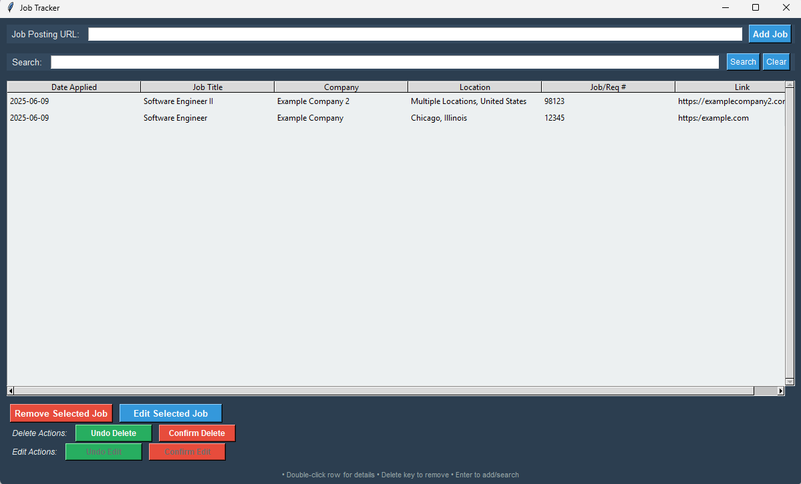

# Personal Job Application Tracker (Tkinter + Excel + Selenium)

A simple desktop GUI app that helps you keep track of jobs you've applied to. It uses **Tkinter** for the UI, **Excel** for persistent storage, and **Selenium** to auto-fill job info from URLs.

## Features

- Add job applications by URL (job title, company, and location are auto-parsed).
- View and manage your job application list in a table.
- Edit any job entry manually.
- Delete selected entries.
- Excel file (`job_applications.xlsx`) saves all data for future use.



The parsing is not perfect, you may need to edit a few of the fields to be correct. It is quite hard to get it right every time, due to how some job postings have their data setup.

## Requirements

- Python 3.7+
- `selenium`
- `requests`
- `beautifulsoup4`
- `openpyxl`

Install dependencies:

```bash
pip install selenium requests beautifulsoup4 openpyxl
```

You also need [**ChromeDriver**](https://sites.google.com/chromium.org/driver/) in your system `PATH`.

## Usage

Run the app:

```bash
python job_tracker.py
```

### Notes:
- Parsed info (job title, company, location) may sometimes be incomplete depending on the job page structure.
- You can edit the row manually if parsing fails.

## Files

- `main.py` – Main application code.
- `constants.py` - Holds all the constants used throughout this project.
- `excel_handler.py` - Handles all of the excel logic.
- `gui.py` - Handles all of the gui logic.
- `job_parser.py` - Handles all the data parsing.
- `job_applications.xlsx` – Automatically created Excel file storing job data.
